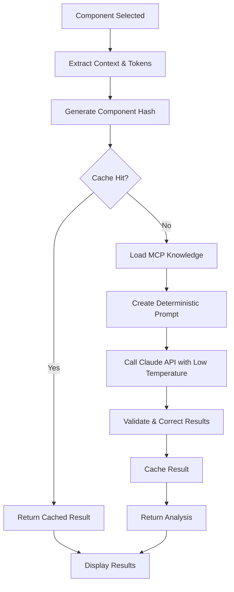

# FigmaLint Consistency Features

## Overview

FigmaLint now includes a **Component Consistency Engine** that ensures deterministic and repeatable analysis results. This addresses the core issue of inconsistent scores and analysis content when testing the same component multiple times.

## Key Features

### 🔄 Deterministic Analysis
- **Consistent Results**: Identical components always receive identical analysis scores and recommendations
- **Caching System**: Results are cached for 24 hours to ensure perfect consistency
- **Component Hashing**: Generates unique fingerprints based on component structure and tokens

### 🎯 Design Systems MCP Integration
- **Knowledge Base**: Integrates with your [design systems MCP server](https://github.com/southleft/design-systems-mcp)
- **Best Practices**: Analysis is informed by comprehensive design system knowledge
- **Scoring Methodology**: Consistent scoring criteria based on established design patterns

### 📊 Intelligent Scoring
- **Component Family Aware**: Different scoring criteria for buttons, avatars, inputs, etc.
- **Baseline Scores**: Consistent scoring baselines per component type
- **Objective Criteria**: Scores based on measurable factors, not subjective AI interpretation

## How It Works

### 1. Component Analysis Process



### 2. Component Hashing

The system generates a unique hash based on:
- Component name and type
- Normalized layer hierarchy
- Frame structure (width, height, layout)
- Detected styles (fills, strokes, effects)
- Token fingerprint (all detected tokens)
- Static properties (component family, interactivity)

**Important**: Dynamic context that could vary (like random AI interpretations) is excluded from the hash.

### 3. Design Systems Knowledge Integration

The MCP integration provides:
- **Component Guidelines**: Best practices per component family
- **Token Conventions**: Consistent naming patterns
- **Accessibility Standards**: WCAG compliance requirements
- **Scoring Criteria**: Objective measurement standards

### 4. Consistency Validation

After AI analysis, the system:
1. Validates results against component family expectations
2. Ensures token recommendations follow semantic patterns
3. Applies consistency corrections when needed
4. Caches validated results for future use

## Configuration

### MCP Server Settings

```typescript
const consistencyEngine = new ComponentConsistencyEngine({
  enableCaching: true,
  enableMCPIntegration: true,
  mcpServerUrl: 'https://design-systems-mcp.southleft-llc.workers.dev/mcp',
  consistencyThreshold: 0.95
});
```

### Deterministic API Settings

```typescript
const DETERMINISTIC_CONFIG = {
  temperature: 0.1,  // Low temperature for consistency
  top_p: 0.1,       // Low top_p for deterministic responses
};
```

## Component Family Scoring

### Button Components
- **Structure (25%)**: State completeness, proper hierarchy
- **Tokens (25%)**: Semantic color and spacing usage
- **Accessibility (30%)**: Interactive states, ARIA support
- **Consistency (20%)**: Naming conventions, patterns

### Avatar Components
- **Structure (25%)**: Size variants, fallback handling
- **Tokens (20%)**: Image and background tokens
- **Accessibility (25%)**: Alternative text, interactive states
- **Consistency (30%)**: Sizing patterns, naming

### Input Components
- **Structure (20%)**: Form states, validation feedback
- **Tokens (25%)**: Consistent spacing and colors
- **Accessibility (35%)**: Labels, error messages, keyboard support
- **Consistency (20%)**: Form patterns, naming

### Generic Components
- **Structure (25%)**: Clear hierarchy, organization
- **Tokens (25%)**: Design token usage
- **Accessibility (25%)**: Basic compliance
- **Consistency (25%)**: Naming and patterns

## Cache Management

### Cache Lifetime
- **Duration**: 24 hours per cached result
- **Invalidation**: Automatic cleanup of expired entries
- **Version Tracking**: MCP knowledge version tracking

### Cache Identification
```
Component Hash: abc123xyz
├── Component Structure
├── Token Fingerprint
├── Component Family
└── Interaction Pattern
```

## Usage Examples

### Consistent Analysis
```typescript
// First analysis
const result1 = await analyzeComponent(buttonComponent);
// Score: 85, States: [hover, focus, active, disabled]

// Second analysis (identical component)
const result2 = await analyzeComponent(buttonComponent);
// Score: 85, States: [hover, focus, active, disabled] (identical)
```

### Change Detection
```typescript
// Original component
const original = await analyzeComponent(buttonComponent);
// Score: 75

// After adding a design token
const improved = await analyzeComponent(buttonComponentWithTokens);
// Score: 85 (higher due to token usage)
```

### Batch Consistency
```typescript
// Analyze multiple similar components
const batchResults = await batchAnalyze([button1, button2, button3]);
// All identical buttons get identical scores and recommendations
```

## Benefits

### ✅ For Designers
- **Predictable Results**: Same component = same analysis
- **Clear Progress Tracking**: Changes result in score improvements/decreases
- **Informed Decisions**: Analysis based on design system best practices
- **Time Savings**: Cached results for repeated analyses

### ✅ For Design Systems
- **Consistent Standards**: Analysis follows established patterns
- **Knowledge Integration**: Leverages your design system documentation
- **Scalable Guidelines**: Consistent application across all components
- **Quality Assurance**: Objective scoring criteria

### ✅ For Development
- **Deterministic Behavior**: Predictable plugin behavior
- **Performance**: Cached results improve response times
- **Reliability**: Reduced API calls and consistent outputs
- **Debugging**: Clear traceability of analysis decisions

## Troubleshooting

### Cache Issues
```bash
# Clear cache (if needed)
# Cache automatically expires after 24 hours
console.log('Cache entries:', consistencyEngine.cache.size);
```

### MCP Connection Issues
```bash
# Check MCP server connectivity
# Falls back to built-in knowledge if MCP unavailable
console.log('MCP Status:', mcpIntegrationEnabled);
```

### Inconsistent Results (Legacy)
If you're still seeing inconsistent results:
1. Ensure you're using the latest version with consistency engine
2. Check that MCP integration is enabled
3. Verify component hasn't actually changed between analyses
4. Clear browser cache and restart Figma

## Future Enhancements

- **Advanced Caching**: Persistent cache across Figma sessions
- **Custom Scoring**: User-defined scoring criteria
- **Team Consistency**: Shared cache across team members
- **Analytics**: Component consistency metrics and trends

---

**Note**: This consistency engine ensures that your design system analysis is reliable, predictable, and based on established best practices. Identical components will always receive identical analysis results, while changes to components will be accurately reflected in updated scores and recommendations.
